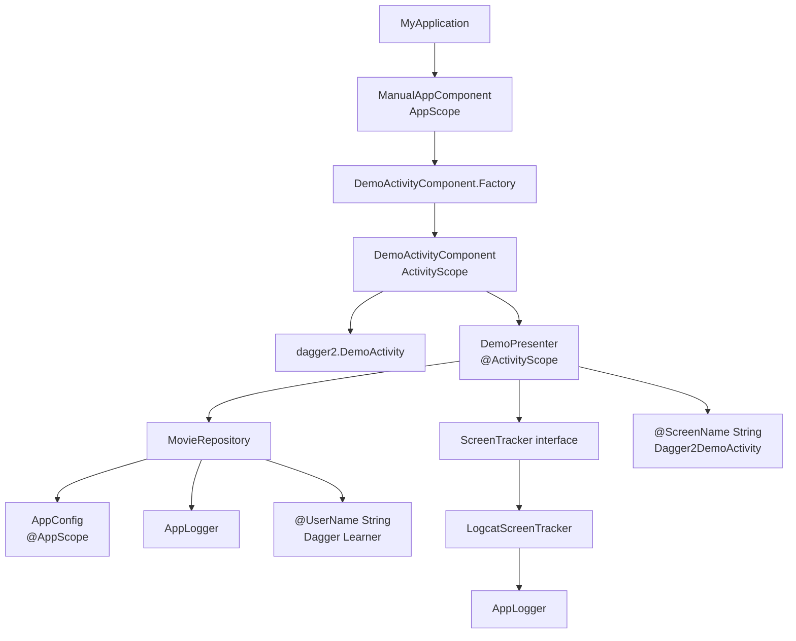

# 从编译产物理解 Dagger2 核心原理

本文基于当前工程已经编译生成的代码来解释 Dagger2。入口示例是手机上显示的 `Dagger2` 页面，对应源码包：

- 业务对象：`app/src/main/java/com/ellison/jetpackdemo/dagger2/Core.kt`
- 对象图声明：`app/src/main/java/com/ellison/jetpackdemo/dagger2/Graph.kt`
- 注入入口：`app/src/main/java/com/ellison/jetpackdemo/dagger2/DemoActivity.kt`
- 编译产物：`app/build/generated/source/kapt/debug/com/ellison/jetpackdemo/dagger2/`

## 先给结论

从编译后的文件理解 Dagger 是很有效的，因为 Dagger 本质上不是运行时魔法，而是编译期代码生成。

你在源码里写的 `@Inject`、`@Module`、`@Component`、`@Subcomponent`，最终都会变成普通 Java 代码：`new Xxx(...)`、`Provider<T>`、`Factory<T>`、`MembersInjector<T>`。因此最容易理解 Dagger 的角度是：

1. 先看你声明了哪些对象和依赖。
2. 再看 Dagger 生成了哪些 `Factory`。
3. 最后看 `DaggerManualAppComponent` 如何把这些 `Factory` 连接成对象图。

一句话概括：Dagger 帮你把“对象怎么创建、按什么顺序创建、能不能复用、注入到哪里”在编译期写成了 Java 代码。

## 当前示例的对象图

当前页面显示的内容来自 `DemoPresenter.buildDemoText()`。`DemoPresenter` 不是手动 `new` 的，而是 Dagger 注入到 Activity 字段里的。

对象图可以画成这样：



这张图里的每条箭头，都能在生成代码里找到对应的 `Provider.get()` 或 `new Xxx(...)`。

## 源码层：你告诉 Dagger 什么

### 1. `@Inject constructor` 表示“这个类可以这样创建”

在 `Core.kt` 中：

```kotlin
class MovieRepository @Inject constructor(
    private val appConfig: AppConfig,
    private val logger: AppLogger,
    @UserName private val userName: String
)
```

含义是：如果 Dagger 能找到 `AppConfig`、`AppLogger`、`@UserName String`，它就可以创建 `MovieRepository`。

同理：

```kotlin
class DemoPresenter @Inject constructor(
    private val movieRepository: MovieRepository,
    private val screenTracker: ScreenTracker,
    @ScreenName private val screenName: String
)
```

这不是“立即创建对象”，而是告诉 Dagger 一条创建规则。

### 2. `@Provides` 表示“这个对象不能靠构造函数推导，要调用方法创建”

在 `Graph.kt` 中：

```kotlin
@Provides
@AppScope
fun provideAppConfig(): AppConfig = AppConfig(appName = "JetpackDemo")
```

`AppConfig` 是 data class，没有 `@Inject constructor`。Dagger 不知道默认应该传什么 `appName`，所以这里用 `@Provides` 明确告诉它。

### 3. `@Binds` 表示“接口用哪个实现类”

在 `Graph.kt` 中：

```kotlin
@Binds
@ActivityScope
fun bindScreenTracker(tracker: LogcatScreenTracker): ScreenTracker
```

`DemoPresenter` 依赖的是接口 `ScreenTracker`，Dagger 无法直接 `new ScreenTracker()`。这条绑定告诉 Dagger：要 `ScreenTracker` 时，实际使用 `LogcatScreenTracker`。

### 4. `@BindsInstance` 表示“运行时传入的值也放进对象图”

当前有两个运行时参数：

```kotlin
fun create(@BindsInstance @UserName userName: String): ManualAppComponent
fun create(@BindsInstance @ScreenName screenName: String): DemoActivityComponent
```

它们分别来自：

```kotlin
DaggerManualAppComponent.factory().create("Dagger Learner")
.demoActivityComponentFactory()
.create("Dagger2DemoActivity")
```

所以页面上能显示：

```text
@ScreenName = Dagger2DemoActivity
[Dagger Learner] search "Batman" from JetpackDemo
```

## 编译产物层：Dagger 真的生成了什么

### 1. 每个可创建对象都有一个 `Factory`

`DemoPresenter_Factory.java` 的核心逻辑是：

```java
return new DemoPresenter(movieRepository, screenTracker, screenName);
```

对应源码里的：

```kotlin
class DemoPresenter @Inject constructor(
    private val movieRepository: MovieRepository,
    private val screenTracker: ScreenTracker,
    @ScreenName private val screenName: String
)
```

`MovieRepository_Factory.java` 的核心逻辑是：

```java
return new MovieRepository(appConfig, logger, userName);
```

所以 `Factory` 的作用很简单：把构造函数依赖都准备好，然后调用构造函数。

### 2. 字段注入会生成 `MembersInjector`

`DemoActivity` 中有字段注入：

```kotlin
@Inject
lateinit var presenter: DemoPresenter
```

Dagger 生成 `DemoActivity_MembersInjector.java`，核心逻辑是：

```java
instance.presenter = presenter;
```

所以字段注入本质也不是反射，而是编译期生成一段普通赋值代码。

### 3. `DaggerManualAppComponent` 是对象图总装配器

最关键的文件是：

```text
app/build/generated/source/kapt/debug/com/ellison/jetpackdemo/dagger2/DaggerManualAppComponent.java
```

它把所有规则合并成最终对象图。

里面有两层实现：

```java
private static final class ManualAppComponentImpl implements ManualAppComponent
private static final class DemoActivityComponentImpl implements DemoActivityComponent
```

这对应源码里的：

```kotlin
@Component
interface ManualAppComponent

@Subcomponent
interface DemoActivityComponent
```

也就是说：`@Component` 和 `@Subcomponent` 最后都会变成具体的 Java 实现类。

## 当前对象创建流程

### 第一步：Application 创建 App 级组件

源码：

```kotlin
val manualAppComponent: ManualAppComponent by lazy {
    DaggerManualAppComponent.factory().create("Dagger Learner")
}
```

生成代码：

```java
public ManualAppComponent create(String userName) {
    Preconditions.checkNotNull(userName);
    return new ManualAppComponentImpl(userName);
}
```

这里 `userName` 被保存到 `ManualAppComponentImpl` 里，后面创建 `MovieRepository` 时会用到。

### 第二步：Activity 创建子组件

源码：

```kotlin
.demoActivityComponentFactory()
.create("Dagger2DemoActivity")
.inject(this)
```

生成代码：

```java
public DemoActivityComponent create(String screenName) {
    Preconditions.checkNotNull(screenName);
    return new DemoActivityComponentImpl(manualAppComponentImpl, screenName);
}
```

这里可以看到两个关键信息：

- 子组件持有父组件 `manualAppComponentImpl`
- 子组件额外保存自己的运行时参数 `screenName`

这就是为什么 `DemoActivityComponent` 既能访问 App 级对象，也能访问 Activity 级对象。

### 第三步：执行字段注入

生成代码：

```java
public void inject(DemoActivity activity) {
    injectDemoActivity(activity);
}

private DemoActivity injectDemoActivity(DemoActivity instance) {
    DemoActivity_MembersInjector.injectPresenter(instance, demoPresenterProvider.get());
    return instance;
}
```

这里的重点是 `demoPresenterProvider.get()`。它会触发整个依赖链创建。

### 第四步：创建 `DemoPresenter`

生成代码：

```java
return new DemoPresenter(
    demoActivityComponentImpl.movieRepository(),
    demoActivityComponentImpl.bindScreenTrackerProvider.get(),
    demoActivityComponentImpl.screenName
);
```

再看 `movieRepository()`：

```java
return new MovieRepository(
    manualAppComponentImpl.provideAppConfigProvider.get(),
    new AppLogger(),
    manualAppComponentImpl.userName
);
```

这就是 Dagger 对象图最直观的样子：一层一层调用 `Provider.get()` 和构造函数。

## Scope 到底做了什么

当前有两个 Scope：

- `@AppScope`
- `@ActivityScope`

在生成代码里，Scope 通常体现为 `DoubleCheck.provider(...)`：

```java
this.provideAppConfigProvider = DoubleCheck.provider(...)
this.demoPresenterProvider = DoubleCheck.provider(...)
this.bindScreenTrackerProvider = DoubleCheck.provider(...)
```

可以把它理解成带缓存的 Provider：

- 第一次 `get()`：创建对象并缓存。
- 后续 `get()`：返回缓存对象。
- 缓存范围由 Component 生命周期决定。

所以：

- `@AppScope AppConfig` 缓存在 `ManualAppComponentImpl` 中，跟随 Application 级组件。
- `@ActivityScope DemoPresenter` 缓存在 `DemoActivityComponentImpl` 中，跟随当前 Activity 子组件。

注意：Scope 不是全局单例本身。Scope 的真实边界是“它被哪个 Component 持有”。如果你重新创建一个新的 `DemoActivityComponent`，`@ActivityScope` 对象也会重新创建一份。

## Qualifier 解决了什么问题

当前有两个 String：

```kotlin
@UserName String
@ScreenName String
```

如果没有 `@UserName` 和 `@ScreenName`，Dagger 只看到两个 `String`，无法判断哪个 String 应该传给哪个构造函数参数。

`@Qualifier` 的作用就是给同类型依赖加标签：

```kotlin
@Qualifier
annotation class UserName

@Qualifier
annotation class ScreenName
```

所以当前对象图里并不是简单的 `String`，而是两种不同的依赖键：

- `@UserName String`
- `@ScreenName String`

这是理解 Dagger 的关键：Dagger 查找依赖时看的不是“类型”一个维度，而是“类型 + Qualifier”。

## Component 和 Subcomponent 的关系

当前结构是：

```text
ManualAppComponent
└── DemoActivityComponent
```

`ManualAppComponent` 保存 App 级依赖，例如：

- `@UserName String`
- `AppConfig`

`DemoActivityComponent` 保存 Activity 级依赖，例如：

- `@ScreenName String`
- `DemoPresenter`
- `ScreenTracker`

生成代码里 `DemoActivityComponentImpl` 持有 `ManualAppComponentImpl`：

```java
private final ManualAppComponentImpl manualAppComponentImpl;
```

这说明子组件可以复用父组件中的依赖。当前 `MovieRepository` 就同时用到了父组件的 `AppConfig`、`userName`，以及普通 `AppLogger`。

## 如何继续从编译产物学习

建议按这个顺序看：

1. 看 `Graph.kt`：确认对象图入口、模块、组件、子组件。
2. 看 `Core.kt`：确认哪些类有 `@Inject constructor`。
3. 看 `*_Factory.java`：理解每个对象如何被创建。
4. 看 `*_MembersInjector.java`：理解字段注入如何变成赋值。
5. 看 `DaggerManualAppComponent.java`：理解所有 Provider 如何被组织成完整对象图。

不要一开始就看 Hilt 生成代码。Hilt 生成代码更多，包含 Android 生命周期和聚合元数据。当前这个纯 Dagger2 示例更适合入门，因为它清楚展示了：

- Component 是对象图容器。
- Module 是补充创建规则。
- Inject constructor 是构造函数创建规则。
- Provider 是延迟创建入口。
- Scope 是 Provider 缓存策略。
- Qualifier 是依赖键标签。
- MembersInjector 是字段赋值器。

## 和手写代码的对照

如果不用 Dagger，当前示例大概需要手写成这样：

```kotlin
val appConfig = AppConfig("JetpackDemo")
val userName = "Dagger Learner"
val appLogger1 = AppLogger()
val repository = MovieRepository(appConfig, appLogger1, userName)

val appLogger2 = AppLogger()
val tracker = LogcatScreenTracker(appLogger2)
val presenter = DemoPresenter(repository, tracker, "Dagger2DemoActivity")

activity.presenter = presenter
```

Dagger 做的就是把这段代码自动生成出来，并且在编译期检查：

- 依赖是否缺失。
- 接口是否没有绑定实现。
- 同类型依赖是否冲突。
- Scope 是否使用在正确的 Component 上。
- 运行时参数是否通过 `@BindsInstance` 提供。

所以 Dagger 的核心价值不是“少写几个 new”，而是让复杂对象图可维护、可检查、可复用。

## 读当前页面的一句话解释

页面里的：

```text
Pure Dagger2 demo is ready.
- App scope object: ManualAppComponent
- Activity scope object: DemoActivityComponent
- Subcomponent runtime param: @ScreenName = Dagger2DemoActivity
- Repository result: [Dagger Learner] search "Batman" from JetpackDemo
```

对应的含义是：

- `ManualAppComponent` 创建并保存 App 级对象图。
- `DemoActivityComponent` 是 Activity 级子对象图。
- `@ScreenName` 是 Activity 子组件创建时传入的运行时参数。
- `MovieRepository` 同时拿到了 `@UserName String` 和 `AppConfig`，所以能输出用户和应用名。

这就是当前工程里 Dagger2 对象图真实运行起来后的结果。

## 怎么判断 `DaggerManualAppComponent` 是对象图总装配器

可以从五个证据判断，而不是只靠文件名猜。

### 证据 1：它是 `@Component` 接口的生成实现

源码中对象图入口声明在 `Graph.kt`：

```kotlin
@AppScope
@Component(modules = [AppModule::class, SubcomponentsModule::class])
interface ManualAppComponent {
    fun demoActivityComponentFactory(): DemoActivityComponent.Factory

    @Component.Factory
    interface Factory {
        fun create(@BindsInstance @UserName userName: String): ManualAppComponent
    }
}
```

编译后出现：

```text
DaggerManualAppComponent.java
```

Dagger 的生成命名规则是：

```text
Dagger + Component接口名
```

所以 `ManualAppComponent` 的实现类就是 `DaggerManualAppComponent`。这已经说明它不是普通业务类，而是 Dagger 为 Component 生成的入口类。

更关键的是生成代码内部有：

```java
private static final class ManualAppComponentImpl implements ManualAppComponent
```

这行直接证明：`DaggerManualAppComponent` 文件里包含了 `ManualAppComponent` 的真实实现。

### 证据 2：它提供对象图创建入口 `factory().create(...)`

业务代码中 Application 是这样启动对象图的：

```kotlin
DaggerManualAppComponent.factory().create("Dagger Learner")
```

生成代码中对应：

```java
public static ManualAppComponent.Factory factory() {
    return new Factory();
}

private static final class Factory implements ManualAppComponent.Factory {
    @Override
    public ManualAppComponent create(String userName) {
        Preconditions.checkNotNull(userName);
        return new ManualAppComponentImpl(userName);
    }
}
```

这说明 `DaggerManualAppComponent` 是对象图的启动器。它接收 `@BindsInstance @UserName String`，然后创建真正保存依赖关系的 `ManualAppComponentImpl`。

如果一个生成类负责创建 Component 实例，它就是对象图入口。

### 证据 3：它集中保存 Provider，也就是对象创建规则

在 `DaggerManualAppComponent.java` 里能看到：

```java
private Provider<AppConfig> provideAppConfigProvider;
```

在子组件实现里还能看到：

```java
private Provider<LogcatScreenTracker> logcatScreenTrackerProvider;
private Provider<ScreenTracker> bindScreenTrackerProvider;
private Provider<DemoPresenter> demoPresenterProvider;
```

这些 `Provider` 就是对象图里的节点。每个 `Provider<T>` 都表示“我知道怎么得到一个 T”。

所以对象图不是一张运行时可视化图片，而是这些 Provider 字段和它们之间的调用关系。

### 证据 4：它把 Module、Inject 构造函数、运行时参数都串起来了

看生成代码里的 `movieRepository()`：

```java
private MovieRepository movieRepository() {
    return new MovieRepository(
        manualAppComponentImpl.provideAppConfigProvider.get(),
        new AppLogger(),
        manualAppComponentImpl.userName
    );
}
```

这一段同时串起了三类来源：

- `provideAppConfigProvider.get()`：来自 `@Module + @Provides`
- `new AppLogger()`：来自 `@Inject constructor`
- `manualAppComponentImpl.userName`：来自 `@BindsInstance @UserName`

这就是“总装配器”的核心特征：它不是只创建某一个类，而是把不同来源的依赖统一组装成完整对象。

再看创建 `DemoPresenter`：

```java
return new DemoPresenter(
    demoActivityComponentImpl.movieRepository(),
    demoActivityComponentImpl.bindScreenTrackerProvider.get(),
    demoActivityComponentImpl.screenName
);
```

这里又串起了：

- `MovieRepository`
- `ScreenTracker`
- `@ScreenName String`

也就是说，Dagger 不是给每个类孤立生成代码，而是在 `DaggerManualAppComponent` 里把所有依赖链闭合起来。

### 证据 5：它负责执行注入终点 `inject(activity)`

源码里调用：

```kotlin
.inject(this)
```

生成代码里对应：

```java
@Override
public void inject(DemoActivity activity) {
    injectDemoActivity(activity);
}

private DemoActivity injectDemoActivity(DemoActivity instance) {
    DemoActivity_MembersInjector.injectPresenter(instance, demoPresenterProvider.get());
    return instance;
}
```

这说明 `DaggerManualAppComponent` 不只是保存对象创建规则，它还知道最终要把对象注入到哪里。

当前注入终点是：

```kotlin
@Inject
lateinit var presenter: DemoPresenter
```

最终生成代码会变成：

```java
instance.presenter = presenter;
```

因此从入口 `factory().create(...)` 到终点 `inject(activity)`，中间所有依赖都由 `DaggerManualAppComponent` 文件里的实现类组织起来。

## 判断一个 Dagger 生成类是不是对象图装配器的方法

以后看其他项目时，可以用这个 checklist：

1. 文件名是否是 `Dagger + Component接口名`。
2. 内部是否有 `implements XxxComponent`。
3. 是否有 `factory()`、`builder()` 或 `create()` 入口。
4. 是否保存大量 `Provider<T>` 字段。
5. 是否有 `initialize(...)` 方法连接 Provider。
6. 是否有 `inject(...)` 方法或暴露对象的方法。
7. 是否把 `@Provides`、`@Inject constructor`、`@BindsInstance`、`@Binds` 的来源组合到一起。

如果这些条件都满足，它基本就是该 Component 对应的对象图装配器。

放到当前项目里，`DaggerManualAppComponent` 满足全部条件，所以可以明确说：它是当前纯 Dagger2 示例的对象图总装配器。
