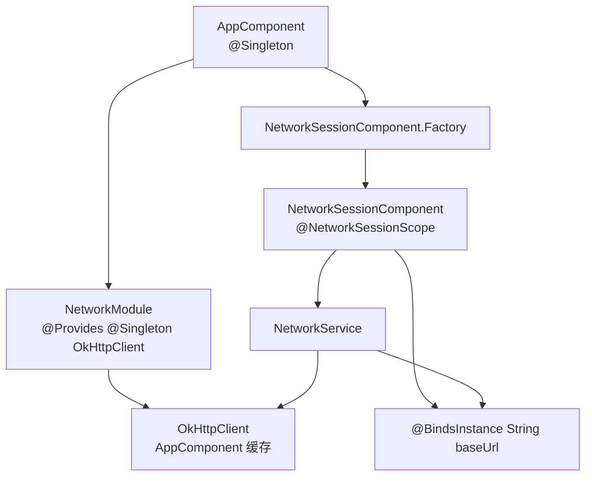

# Dagger：`NetworkService` 与 `NetworkModule` 绑定逻辑分析

本文记录下面这段代码的编译结论，以及 `NetworkService` 为什么能拿到 `NetworkModule` 中提供的 `OkHttpClient`。

```java
class NetworkService {

    private final OkHttpClient client;

    @Inject
    NetworkService(OkHttpClient client) {
        this.client = client;
    }
}

@Module
class NetworkModule {

    @Provides
    static OkHttpClient provideOkHttpClient() {
        return new OkHttpClient.Builder()
                .build();
    }
}

@Component(modules = NetworkModule.class)
interface AppComponent {

    NetworkService getNetworkService();
}
```

## 会不会编译报错

不会因为 Dagger 依赖图报错。

前提是普通 Java / Android 工程条件都满足：

- 已经添加 OkHttp 依赖；
- 已经添加 Dagger 依赖；
- 已经配置 annotation processor，例如 `kapt` 或 `annotationProcessor`；
- import 正确，例如 `javax.inject.Inject`、`dagger.Module`、`dagger.Provides`、`dagger.Component`。

从 Dagger 依赖图角度看，这段代码是完整的：

```text
AppComponent.getNetworkService()
        |
        v
需要 NetworkService
        |
        v
NetworkService 有 @Inject 构造函数
        |
        v
构造函数需要 OkHttpClient
        |
        v
NetworkModule 有 @Provides OkHttpClient
        |
        v
调用 provideOkHttpClient()
        |
        v
new NetworkService(okHttpClient)
```

Dagger 生成代码可以理解成近似这样：

```java
final class DaggerAppComponent implements AppComponent {

    @Override
    public NetworkService getNetworkService() {
        OkHttpClient client = NetworkModule.provideOkHttpClient();
        return new NetworkService(client);
    }
}
```

实际生成代码通常会经过 `Factory` 和 `Provider` 包装，但核心逻辑就是：

```text
先得到 OkHttpClient，再创建 NetworkService
```

## 为什么 `OkHttpClient` 必须由 Module 提供

`OkHttpClient` 是第三方库对象。你不能修改它的构造函数，也不能给它的构造函数加 `@Inject`。

所以 Dagger 不能靠下面这种方式自动创建：

```java
new OkHttpClient()
```

更不能自动猜测你想用：

```java
new OkHttpClient.Builder().build()
```

因此需要：

```java
@Provides
static OkHttpClient provideOkHttpClient() {
    return new OkHttpClient.Builder().build();
}
```

`@Provides` 的含义是：当对象图里需要 `OkHttpClient` 时，可以调用这个方法获取。

## `NetworkService` 为什么知道去 `NetworkModule` 找

严格说，`NetworkService` 自己并不知道去哪里找。

真正负责查找和连接依赖的是 Dagger 为 `AppComponent` 生成的代码。

这行代码很关键：

```java
@Component(modules = NetworkModule.class)
```

它表示：`NetworkModule` 里的 `@Provides` 绑定会加入 `AppComponent` 的对象图。

然后 Dagger 分析：

```java
@Inject
NetworkService(OkHttpClient client)
```

这表示创建 `NetworkService` 时需要一个依赖 Key：

```text
OkHttpClient
```

再分析：

```java
@Provides
static OkHttpClient provideOkHttpClient()
```

这表示 `NetworkModule` 提供一个依赖 Key：

```text
OkHttpClient
```

两者匹配，所以 Dagger 连接成功。

```text
需要的 Key：OkHttpClient
提供的 Key：OkHttpClient
```

## 不是根据命名匹配

Dagger 不会根据这些名字匹配：

- `NetworkService`
- `NetworkModule`
- `provideOkHttpClient`
- `client`

真正的匹配规则是：

```text
依赖 Key = 类型 + 限定符
```

当前没有 `@Named` 或自定义 `@Qualifier`，所以 Key 就是：

```text
OkHttpClient
```

因此，即使把 Module 和方法改名，只要 Component 引入了它，返回类型仍然是 `OkHttpClient`，也能匹配：

```java
@Module
class AbcModule {

    @Provides
    static OkHttpClient createAnything() {
        return new OkHttpClient.Builder().build();
    }
}

@Component(modules = AbcModule.class)
interface AppComponent {
    NetworkService getNetworkService();
}
```

这里方法名叫 `createAnything()`，Module 名叫 `AbcModule`，仍然可以工作。

原因是：

```text
NetworkService 需要 OkHttpClient
AbcModule 提供 OkHttpClient
AppComponent 引入了 AbcModule
```

## 如果有多个 Module 会怎样

例如：

```java
@Component(modules = {
    NetworkModule.class,
    OtherModule.class
})
interface AppComponent {
    NetworkService getNetworkService();
}
```

Dagger 会在 `AppComponent` 注册的所有 Module 和可用的 `@Inject` 构造函数里查找 `OkHttpClient` 绑定。

结果有三种：

### 1. 只有一个 `OkHttpClient` 绑定

编译通过。

```text
需要 OkHttpClient
找到唯一 OkHttpClient
使用它
```

### 2. 没有 `OkHttpClient` 绑定

编译失败。

典型错误类似：

```text
OkHttpClient cannot be provided without an @Inject constructor or an @Provides-annotated method
```

原因是 Dagger 不知道如何创建 `OkHttpClient`。

### 3. 有多个无区分的 `OkHttpClient` 绑定

编译失败。

例如：

```java
@Module
class NetworkModule {
    @Provides
    static OkHttpClient provideOkHttpClient() {
        return new OkHttpClient.Builder().build();
    }
}

@Module
class OtherModule {
    @Provides
    static OkHttpClient provideAnotherOkHttpClient() {
        return new OkHttpClient.Builder().build();
    }
}
```

这两个方法虽然方法名不同，但都提供同一个 Key：

```text
OkHttpClient
```

Dagger 不会根据方法名判断哪个更适合 `NetworkService`，而是报重复绑定错误。

## 如何区分多个 `OkHttpClient`

如果确实需要两个不同的 `OkHttpClient`，要加限定符。

例如使用 `@Named`：

```java
@Module
class NetworkModule {

    @Provides
    @Named("api")
    static OkHttpClient provideApiClient() {
        return new OkHttpClient.Builder().build();
    }

    @Provides
    @Named("upload")
    static OkHttpClient provideUploadClient() {
        return new OkHttpClient.Builder().build();
    }
}
```

使用方也要写清楚需要哪个：

```java
class NetworkService {

    private final OkHttpClient client;

    @Inject
    NetworkService(@Named("api") OkHttpClient client) {
        this.client = client;
    }
}
```

此时依赖 Key 变成：

```text
@Named("api") OkHttpClient
```

另一个是：

```text
@Named("upload") OkHttpClient
```

Dagger 就能准确区分。

## 什么时候会报错

下面几种情况会报错。

### 删除 `@Provides OkHttpClient`

```java
@Component
interface AppComponent {
    NetworkService getNetworkService();
}
```

`NetworkService` 仍然需要 `OkHttpClient`，但对象图里没有提供方式，会报缺失绑定。

### `NetworkService` 没有 `@Inject` 构造函数

```java
class NetworkService {
    NetworkService(OkHttpClient client) {
        this.client = client;
    }
}
```

如果没有额外提供：

```java
@Provides
static NetworkService provideNetworkService(OkHttpClient client)
```

Dagger 就不知道怎么创建 `NetworkService`。

### 存在两个相同 Key 的 `OkHttpClient`

两个无 `@Qualifier` 的 `@Provides OkHttpClient` 会导致重复绑定。

### `NetworkModule` 没有加入 `AppComponent`

```java
@Component
interface AppComponent {
    NetworkService getNetworkService();
}
```

即使 `NetworkModule` 类存在，只要没有被当前 Component 引入，它就不属于当前对象图。

`Module` 不是全局自动生效的。它必须通过 Component 的 `modules = ...` 加入对应对象图。

## 最终结论

这段代码不会因为 Dagger 依赖图报错。

原因是：

```text
NetworkService 通过 @Inject 构造函数告诉 Dagger：
我需要 OkHttpClient。

AppComponent 通过 modules = NetworkModule.class 告诉 Dagger：
当前对象图包含 NetworkModule。

NetworkModule 通过 @Provides OkHttpClient 告诉 Dagger：
我能提供 OkHttpClient。
```

所以 Dagger 可以生成完整对象创建链。

最重要的理解点是：

```text
Dagger 按 类型 + 限定符 匹配依赖，
不是按类名、方法名、参数名匹配。
```

## 继续扩展：引入 `@Singleton`、`@Subcomponent` 等注解后怎么理解

前面的代码只有四个核心注解：

- `@Inject`
- `@Module`
- `@Provides`
- `@Component`

现在继续在同一个 `NetworkService + OkHttpClient` 场景上扩展，加入更接近真实 Android 项目的写法。

### 1. 加入 `@Singleton`

如果希望同一个 `AppComponent` 内复用同一个 `OkHttpClient`，可以加 `@Singleton`：

```java
import javax.inject.Inject;
import javax.inject.Singleton;

import dagger.Component;
import dagger.Module;
import dagger.Provides;
import okhttp3.OkHttpClient;

class NetworkService {

    private final OkHttpClient client;

    @Inject
    NetworkService(OkHttpClient client) {
        this.client = client;
    }
}

@Module
class NetworkModule {

    @Provides
    @Singleton
    static OkHttpClient provideOkHttpClient() {
        return new OkHttpClient.Builder().build();
    }
}

@Singleton
@Component(modules = NetworkModule.class)
interface AppComponent {

    NetworkService getNetworkService();
}
```

这里要注意：如果 `@Provides` 方法加了 `@Singleton`，`AppComponent` 也要加 `@Singleton`。

否则 Dagger 会报类似错误：

```text
AppComponent (unscoped) may not reference scoped bindings
```

原因是：一个带作用域的对象，必须挂在一个带相同作用域的 Component 上。否则 Dagger 不知道这个缓存对象应该跟谁的生命周期绑定。

### 2. `@Singleton` 的真实含义

`@Singleton` 不是 JVM 全局单例。

它的真实含义是：

```text
在同一个 @Singleton Component 实例内部，只创建一次并缓存。
```

例如：

```java
AppComponent component1 = DaggerAppComponent.create();
AppComponent component2 = DaggerAppComponent.create();

NetworkService service1 = component1.getNetworkService();
NetworkService service2 = component1.getNetworkService();
NetworkService service3 = component2.getNetworkService();
```

如果只有 `OkHttpClient` 是 `@Singleton`，那么：

```text
service1 和 service2 里面拿到的是 component1 缓存的同一个 OkHttpClient。
service3 拿到的是 component2 自己缓存的另一个 OkHttpClient。
```

所以 `@Singleton` 的边界是 Component 实例，不是整个 App 进程的静态全局对象。

Dagger 生成代码通常会用类似 `DoubleCheck.provider(...)` 的方式缓存：

```java
this.provideOkHttpClientProvider =
    DoubleCheck.provider(NetworkModule_ProvideOkHttpClientFactory.create());
```

可以把它理解成：

```java
class SingletonProvider<T> implements Provider<T> {
    private T cached;

    public T get() {
        if (cached == null) {
            cached = create();
        }
        return cached;
    }
}
```

实际实现要处理线程安全，但学习时可以先这样理解。

### 3. 如果 `NetworkService` 也加 `@Singleton`

可以这样写：

```java
@Singleton
class NetworkService {

    private final OkHttpClient client;

    @Inject
    NetworkService(OkHttpClient client) {
        this.client = client;
    }
}
```

这样 `NetworkService` 本身也会在 `AppComponent` 内缓存。

调用：

```java
NetworkService a = component.getNetworkService();
NetworkService b = component.getNetworkService();
```

结果是：

```text
a == b
```

如果 `NetworkService` 不加 `@Singleton`，但 `OkHttpClient` 加了 `@Singleton`，则通常是：

```text
每次 getNetworkService() 创建新的 NetworkService，
但它们内部持有同一个 OkHttpClient。
```

这就是 Scope 要分清“缓存谁”的原因。

## 引入 `@Subcomponent`

真实项目里常见的结构不是只有一个全局 Component，而是：

```text
AppComponent
└── NetworkSessionComponent
```

可以把它理解成：

- `AppComponent`：App 级对象图，保存全局依赖，例如 `OkHttpClient`。
- `NetworkSessionComponent`：一次网络会话、一个页面、一个业务流程级对象图，保存短生命周期依赖，例如 `NetworkService`。

示例代码：

```java
import java.lang.annotation.Retention;
import java.lang.annotation.RetentionPolicy;

import javax.inject.Inject;
import javax.inject.Scope;
import javax.inject.Singleton;

import dagger.BindsInstance;
import dagger.Component;
import dagger.Module;
import dagger.Provides;
import dagger.Subcomponent;
import okhttp3.OkHttpClient;

@Scope
@Retention(RetentionPolicy.RUNTIME)
@interface NetworkSessionScope {
}

class NetworkService {

    private final OkHttpClient client;
    private final String baseUrl;

    @Inject
    NetworkService(OkHttpClient client, String baseUrl) {
        this.client = client;
        this.baseUrl = baseUrl;
    }
}

@Module
class NetworkModule {

    @Provides
    @Singleton
    static OkHttpClient provideOkHttpClient() {
        return new OkHttpClient.Builder().build();
    }
}

@Module(subcomponents = NetworkSessionComponent.class)
class NetworkSubcomponentsModule {
}

@Singleton
@Component(modules = {
    NetworkModule.class,
    NetworkSubcomponentsModule.class
})
interface AppComponent {

    NetworkSessionComponent.Factory networkSessionComponentFactory();
}

@NetworkSessionScope
@Subcomponent
interface NetworkSessionComponent {

    NetworkService getNetworkService();

    @Subcomponent.Factory
    interface Factory {
        NetworkSessionComponent create(@BindsInstance String baseUrl);
    }
}
```

这个版本中，`NetworkService` 多依赖了一个 `String baseUrl`：

```java
@Inject
NetworkService(OkHttpClient client, String baseUrl)
```

`OkHttpClient` 来自父组件 `AppComponent` 的 `NetworkModule`。

`String baseUrl` 来自创建子组件时传入的 `@BindsInstance`：

```java
NetworkSessionComponent session =
    appComponent.networkSessionComponentFactory()
        .create("https://api.example.com/");
```

### `Subcomponent` 的对象图关系

可以画成这样：



关键点：

```text
子组件可以使用父组件里的绑定。
父组件不能反过来使用子组件里的绑定。
```

所以：

- `NetworkSessionComponent` 可以拿到 `AppComponent` 中的 `OkHttpClient`。
- `AppComponent` 不能直接拿到 `NetworkSessionComponent` 中的 `baseUrl`。

## `@Subcomponent` 会不会导致编译报错

上面的 `@Subcomponent` 版本不会因为依赖图报错，因为依赖都闭合了：

```text
NetworkService 需要 OkHttpClient
父组件 AppComponent 提供 OkHttpClient

NetworkService 需要 String baseUrl
子组件 Factory 通过 @BindsInstance 提供 String
```

但是下面几种写法会报错。

### 1. 忘记提供 `baseUrl`

如果写成：

```java
@Subcomponent
interface NetworkSessionComponent {
    NetworkService getNetworkService();
}
```

而 `NetworkService` 需要：

```java
NetworkService(OkHttpClient client, String baseUrl)
```

Dagger 会报缺失 `String` 绑定。

典型原因是：

```text
String 不能通过 @Inject 构造函数创建，
也没有 @Provides String，
也没有 @BindsInstance String。
```

### 2. 子组件和父组件使用同一个 Scope

错误示例：

```java
@Singleton
@Component
interface AppComponent {
}

@Singleton
@Subcomponent
interface NetworkSessionComponent {
}
```

父组件和子组件不能使用同一个 Scope。否则 Dagger 无法表达父子生命周期的层级关系。

正确做法是：

```java
@Singleton
@Component
interface AppComponent {
}

@NetworkSessionScope
@Subcomponent
interface NetworkSessionComponent {
}
```

也就是：父组件用 App 级 Scope，子组件用更短生命周期的自定义 Scope。

### 3. 子组件没有注册到父组件

如果 `AppComponent` 中没有暴露：

```java
NetworkSessionComponent.Factory networkSessionComponentFactory();
```

或者没有通过：

```java
@Module(subcomponents = NetworkSessionComponent.class)
```

让 Dagger 知道父子关系，那么你就不能从 `AppComponent` 创建这个子组件。

学习时可以记住：

```text
Subcomponent 不是全局自动挂载的。
它必须被父 Component 暴露或注册。
```

## 引入 `@Binds`

如果 `NetworkService` 不想直接依赖具体实现，而是依赖接口：

```java
interface HttpClient {
    String name();
}

class OkHttpNetworkClient implements HttpClient {

    private final OkHttpClient okHttpClient;

    @Inject
    OkHttpNetworkClient(OkHttpClient okHttpClient) {
        this.okHttpClient = okHttpClient;
    }

    @Override
    public String name() {
        return "OkHttp";
    }
}

class NetworkService {

    private final HttpClient client;

    @Inject
    NetworkService(HttpClient client) {
        this.client = client;
    }
}
```

这时 Dagger 看到的是：

```text
NetworkService 需要 HttpClient
```

但 `HttpClient` 是接口，不能直接 `new HttpClient()`。

需要用 `@Binds` 告诉 Dagger：

```java
@Module
abstract class HttpClientModule {

    @Binds
    abstract HttpClient bindHttpClient(OkHttpNetworkClient impl);
}
```

含义是：

```text
当对象图需要 HttpClient 时，
使用 OkHttpNetworkClient 作为实现。
```

此时依赖图是：

```text
NetworkService
    |
    v
HttpClient
    |
    v
OkHttpNetworkClient
    |
    v
OkHttpClient
    |
    v
NetworkModule.provideOkHttpClient()
```

`@Binds` 和 `@Provides` 的区别：

```text
@Provides：方法体里手动创建或返回对象。
@Binds：不写方法体，只声明接口到实现类的映射。
```

如果当前工程同时启用了 Hilt 处理器，纯 Dagger 的 `@Module` 还需要注意 Hilt 的 `@InstallIn` 检查。像本项目之前的纯 Dagger2 示例一样，可以给纯 Dagger 模块加：

```java
@DisableInstallInCheck
```

避免 Hilt 把纯 Dagger 模块误判成缺少 `@InstallIn` 的 Hilt 模块。

## 引入自定义 `@Qualifier`

前面说过，Dagger 按：

```text
类型 + 限定符
```

匹配依赖。

`@Named` 是一种通用限定符，但真实项目更推荐自定义限定符，因为它更明确、更不容易写错字符串。

例如两个 `OkHttpClient`：

```java
import javax.inject.Qualifier;

@Qualifier
@Retention(RetentionPolicy.RUNTIME)
@interface ApiClient {
}

@Qualifier
@Retention(RetentionPolicy.RUNTIME)
@interface UploadClient {
}

@Module
class NetworkModule {

    @Provides
    @Singleton
    @ApiClient
    static OkHttpClient provideApiClient() {
        return new OkHttpClient.Builder().build();
    }

    @Provides
    @Singleton
    @UploadClient
    static OkHttpClient provideUploadClient() {
        return new OkHttpClient.Builder().build();
    }
}
```

使用方：

```java
class NetworkService {

    private final OkHttpClient client;

    @Inject
    NetworkService(@ApiClient OkHttpClient client) {
        this.client = client;
    }
}
```

这时依赖 Key 是：

```text
@ApiClient OkHttpClient
```

而不是普通的：

```text
OkHttpClient
```

所以即使对象图里还有：

```text
@UploadClient OkHttpClient
```

Dagger 也不会混淆。

## 引入 `Provider<T>` 和 `Lazy<T>`

如果构造函数写成：

```java
class NetworkService {

    private final Provider<OkHttpClient> clientProvider;

    @Inject
    NetworkService(Provider<OkHttpClient> clientProvider) {
        this.clientProvider = clientProvider;
    }

    OkHttpClient client() {
        return clientProvider.get();
    }
}
```

含义是：

```text
NetworkService 创建时不立刻拿 OkHttpClient。
等调用 provider.get() 时再向 Dagger 请求。
```

如果写成：

```java
class NetworkService {

    private final Lazy<OkHttpClient> lazyClient;

    @Inject
    NetworkService(Lazy<OkHttpClient> lazyClient) {
        this.lazyClient = lazyClient;
    }

    OkHttpClient client() {
        return lazyClient.get();
    }
}
```

`Lazy<T>` 的特点是：

```text
第一次 get() 时创建；
后续 get() 返回同一个 Lazy 内部缓存的对象。
```

简单区分：

```text
Provider<T>：每次 get() 都向对象图请求一次。
Lazy<T>：第一次 get() 才请求，之后在 Lazy 内部复用。
```

如果 `OkHttpClient` 本身是 `@Singleton`，那么两者最终拿到的通常都是同一个 Component 缓存对象。但语义仍然不同：

- `Provider<T>` 表示“我可能多次请求”。
- `Lazy<T>` 表示“我想延迟到第一次使用才创建”。

## 扩展后的最终结论

把这些注解放回 `NetworkService` 示例里，可以形成一套完整理解：

```text
@Inject
声明 NetworkService 如何通过构造函数创建。

@Module + @Provides
声明第三方 OkHttpClient 如何创建。

@Component
声明 App 级对象图，并把 NetworkModule 加入对象图。

@Singleton
声明某个绑定在同一个 AppComponent 实例内缓存复用。

@Subcomponent
声明 AppComponent 下面的子对象图，用来承载更短生命周期的依赖。

@BindsInstance
把运行时参数，例如 baseUrl，放入某个 Component 或 Subcomponent 对象图。

@Scope
自定义子组件生命周期，例如 NetworkSessionScope。

@Binds
声明接口到实现类的映射。

@Qualifier / @Named
区分相同类型的多个绑定，例如多个 OkHttpClient。

Provider<T> / Lazy<T>
控制依赖获取时机。
```

最重要的主线仍然没有变：

```text
Dagger 编译时构建对象图；
对象图里的每个节点都有一个依赖 Key；
依赖 Key = 类型 + 限定符；
Component 决定哪些绑定进入当前对象图；
Scope 决定对象是否在 Component 实例内缓存；
Subcomponent 决定对象图的父子生命周期边界。
```
